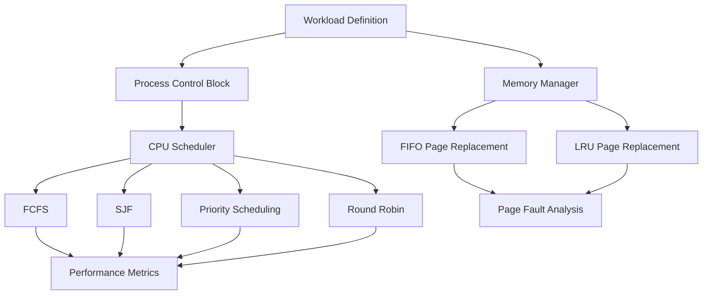

# MiniOS - Operating System & CPU Scheduling Simulator


A modular C++17 simulator for exploring operating-system fundamentals, process management, CPU scheduling, and virtual memory, through deterministic experiments and measurable performance metrics, rather than a bootable kernel.

The goal is to understand **why** these algorithms behave the way they do, not just implement them.

---

## Project Overview

MiniOS currently simulates:

- Process management via a PCB (Process Control Block) model
- Four CPU scheduling algorithms, benchmarked on the same workload
- Virtual memory paging with FIFO and LRU page-replacement, benchmarked on the same reference string
- Gantt-chart style execution visualization
- Reproducible builds via Docker and GitHub Actions CI

The same workload is always run through every algorithm being compared, so results reflect the algorithm's behavior, not differences in test data.

---

## Architecture



---

## CPU Scheduling

| Algorithm | Type | Notes |
|---|---|---|
| **FCFS** | Non-preemptive | Simple; can suffer from the convoy effect |
| **SJF** | Non-preemptive | Minimizes average wait; can starve long processes |
| **Priority** | Non-preemptive | Lower priority number = higher priority |
| **Round Robin** | Preemptive | Fixed time quantum (default = 3); best for responsiveness |

### Metrics computed
- **Waiting time** = Turnaround time - Burst time
- **Turnaround time** = Completion time − Arrival time
- **Response time** = First start time − Arrival time

### Sample workload

| PID | Arrival | Burst | Priority |
|---|---|---|---|
| P1 | 0 | 8 | 2 |
| P2 | 1 | 4 | 1 |
| P3 | 2 | 9 | 3 |
| P4 | 3 | 5 | 4 |
| P5 | 4 | 2 | 5 |

### Results (verified by running `make run`)

| Algorithm | Avg. Waiting | Avg. Turnaround | Avg. Response |
|---|---:|---:|---:|
| FCFS | 11.40 | 17.00 | 11.40 |
| SJF | **8.20** | **13.80** | 8.20 |
| Priority | 11.40 | 17.00 | 11.40 |
| Round Robin (q=3) | 14.60 | 20.20 | **4.60** |

> These numbers are produced by the program itself on the workload above, they are not universal properties of the algorithms, and will change with a different workload. Run `make run` to reproduce them.

**What this shows:** SJF minimizes average waiting and turnaround time for this workload, while Round Robin trades higher waiting time for much better responsiveness, the classic scheduling trade-off, made measurable instead of theoretical. In this particular workload, Priority scheduling matches FCFS exactly, because priority happens to increase in the same order as arrival time, a good example of how a "different" algorithm can produce identical results depending on the input.

---

## Memory Management — Page Replacement

Simulates page faults for a given reference string and frame count, comparing FIFO against LRU.

**Reference string:** `7 0 1 2 0 3 0 4 2 3 0 3 2`
**Frames:** 3

### Results (verified by running `make run`)

| Algorithm | Page Faults |
|---|---:|
| FIFO | 10 |
| LRU | 9 |

LRU produced one fewer page fault than FIFO on this reference string, consistent with LRU generally making better decisions when a workload has locality of reference.

---

## Gantt Chart

Each scheduler records its own execution intervals, e.g. for Round Robin:

```
[P1:3] [P2:3] [P3:3] [P4:3] [P1:3] [P5:2] [P2:1] [P3:3] [P4:2] [P1:2] [P3:3]
```

This makes preemption and context-switching visible instead of hidden inside the algorithm.

---

## Project Structure

```text
MiniOS/
├── .github/workflows/
│   └── ci.yml              # GitHub Actions: build + run on every push
├── include/
│   ├── process.h            # PCB struct + state enum
│   ├── scheduler.h          # Scheduling algorithm declarations
│   └── memory/
│       └── paging.h         # Paging simulator interface
├── src/
│   ├── process.cpp
│   ├── scheduler.cpp        # FCFS, SJF, Priority, Round Robin
│   ├── main.cpp              # Workload definitions + runner
│   └── memory/
│       └── paging.cpp        # FIFO + LRU implementations
├── Dockerfile
├── Makefile
└── README.md
```

---

## Build & Run

**Native:**
```bash
make run
```

**Manually:**
```bash
g++ -std=c++17 -Wall -Wextra -Iinclude -o minios src/main.cpp src/scheduler.cpp src/process.cpp src/memory/paging.cpp
./minios
```

**Docker:**
```bash
docker build -t minios .
docker run --rm minios
```

---

## Continuous Integration

Every push to `main` triggers a GitHub Actions workflow that builds the project and runs the simulator, so a broken build can't silently sit in the repository. See `.github/workflows/ci.yml`.

---

## Roadmap

**Phase 1 — Process Management** ✅
- [x] PCB-style process model, states, and metrics

**Phase 2 — CPU Scheduling** ✅
- [x] FCFS, SJF, Priority, Round Robin
- [x] Gantt chart output, scheduling metrics, algorithm comparison

**Phase 3 — Memory Management** ✅
- [x] Paging simulator, configurable frames
- [x] FIFO and LRU page replacement, page-fault comparison

**Phase 4 — Synchronization** (planned)
- [ ] Threads, mutex-based synchronization
- [ ] Producer–consumer simulation

**Phase 5 — Deadlocks** (planned)
- [ ] Resource allocation model, deadlock detection, Banker's Algorithm

---

## Why I Built This

I wanted to move past *using* cloud and DevOps tools and understand the operating-system fundamentals underneath them, processes, scheduling, memory, and concurrency, the same primitives that cloud platforms are ultimately built on. This is a simulator, not a production OS: the goal is to make these concepts observable and measurable through code, not just read about them.

---

## Scope & Limitations

MiniOS is an educational simulator. It does not boot on hardware, implement a real kernel, manage actual OS-level processes, or provide real virtual memory, it models these concepts in user space so their behavior can be inspected and compared.

---

## Author

**Maila Azam** — Information Technology student, focused on cloud infrastructure, DevOps, and systems-level programming.

[LinkedIn](https://www.linkedin.com/in/maila-azam-637b76373) · [GitHub](https://github.com/Mailazz)
